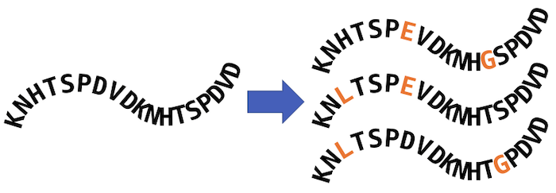
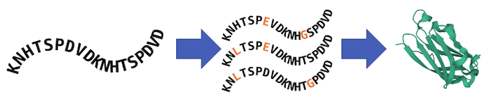
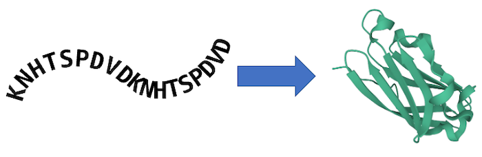

# Awesome Proteomics on AWS 

> A curated list of resources for protein analysis on AWS.

## Contents

- [1. Overview](#1-overview)
- [2. Resources by Workflow Type](#2-resources-by-workflow-type)
- [2.1. Resources for Sequence Homology Search](#21-resources-for-sequence-homology-search)
- [2.2. Resources for Sequence Property Prediction](#22-resources-for-sequence-property-prediction)
- [2.3. Resources for MSA-based Structure Prediction](#23-resources-for-msa-based-structure-prediction)
- [2.4. Resources for LLM-based Structure Prediction](#24-resources-for-llm-based-structure-prediction)
- [3. Contribute](#3-contribute)

## 1. Overview

Knowing the physical structure of proteins is an important part of both small molecule and biologics drug R&D. Machine learning algorithms like DeepMind’s AlphaFold can significantly reduce the cost and time required to generate usable protein structures. These high-profile projects have inspired increased development of AI-driven workflows for protein structure prediction, de novo protein design, and protein-ligand interaction analysis. AWS pharmaceutical and life science customers believe that these in silico tools can help reduce the cost and time required to bring new therapeutics to market.

AWS technical teams have developed solutions to common proteomics problems. These use a variety of services to best fit the needs of our customers.

---

## 2. Resources by Workflow Type

### 2.1. Resources for Sequence Homology Search

- [AWS Batch Architecture for JackHMMER/HHBlits](https://github.com/aws-samples/aws-batch-arch-for-protein-folding)

---

### 2.2. Resources for Sequence Property Prediction

- [Blog: Fine-tune and deploy the ProtBERT model for protein classification using Amazon SageMaker](https://aws.amazon.com/blogs/machine-learning/fine-tune-and-deploy-the-protbert-model-for-protein-classification-using-amazon-sagemaker/)

---

### 2.3. Resources for MSA-Based Structure Prediction

- [Blog: Run AlphaFold v2.0 on Amazon EC2](https://aws.amazon.com/blogs/machine-learning/run-alphafold-v2-0-on-amazon-ec2/)
- [Blog: Predicting protein structures at scale using AWS Batch](https://aws.amazon.com/blogs/industries/predicting-protein-structures-at-scale-using-aws-batch/)
- [Blog: Optimize Protein Folding Costs with OpenFold on AWS Batch](https://aws.amazon.com/blogs/hpc/optimize-protein-folding-costs-with-openfold-on-aws-batch/)
- [AWS Batch Architecture for AlphaFold 2.0](https://github.com/aws-samples/aws-batch-arch-for-protein-folding)
- [AWS Batch Architecture for AlphaFold-Multimer](https://github.com/aws-samples/aws-batch-arch-for-protein-folding)
- [AWS Batch Architecture for OpenFold](https://github.com/aws-samples/aws-batch-arch-for-protein-folding)
- [AWS Batch Architecture for OmegaFold](https://github.com/aws-samples/aws-batch-arch-for-protein-folding)
- [AWS Batch Architecture for RoseTTAFold](https://github.com/aws-samples/aws-rosettafold)

---

### 2.4. Resources for LLM-Based Structure Prediction

- [AWS Batch Architecture for OmegaFold](https://github.com/aws-samples/aws-batch-arch-for-protein-folding)

---

## 3. Contribute

Contributions welcome! Read the [contribution guidelines](contributing.md) first.
